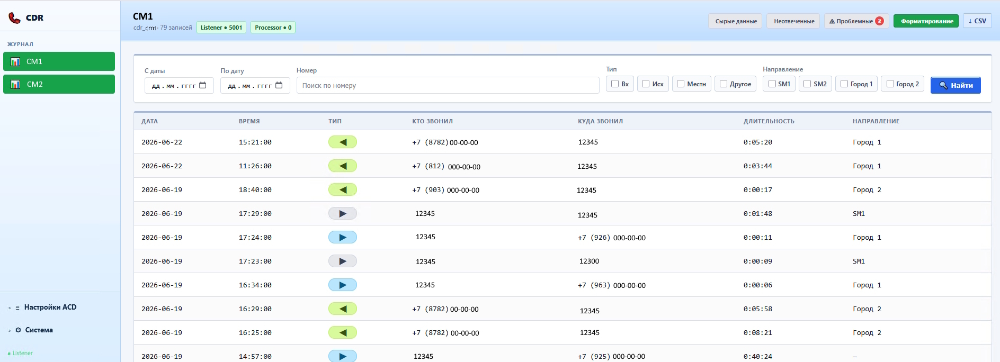

# Avaya CDR Journal

Web-система для приёма, обработки и просмотра CDR-записей Avaya.

## Платформа

- Ubuntu Server
- Python
- PostgreSQL
- Docker
- systemd

## Communication Manager

Может:

- принимать CDR по TCP;
- работать с `customized` CDR layout;
- хранить raw CDR;
- формировать итоговый журнал вызовов;
- агрегировать CDR-цепочки по UCID;
- учитывать `cond-code`, `seq-num`, `in-trk-code`, `code-used`;
- показывать входящие, исходящие, местные, неотвеченные и проблемные записи;
- использовать справочник транков и направлений;
- показывать raw CDR для отладки.

## Web

Может:

- показывать итоговый журнал;
- фильтровать звонки по дате, номеру, типу и направлению;
- показывать raw CDR;
- настраивать ACD;
- настраивать CDR layout;
- вести словари;
- вести справочник транков;
- показывать диагностику сервисов.

## Session Manager

Планируется:

- сбор CDR XML;
- хранение SM raw;
- просмотр SM raw;
- сопоставление CM CDR и SM CDR XML, где это возможно.

## Статус

Проект в разработке.

Код будет опубликован позже, после очистки истории, подготовки документации и обезличенных примеров.

## Связь

Автор: [vovan-T](https://github.com/vovan-T)

Вопросы и предложения можно оставлять в Issues этого репозитория.
