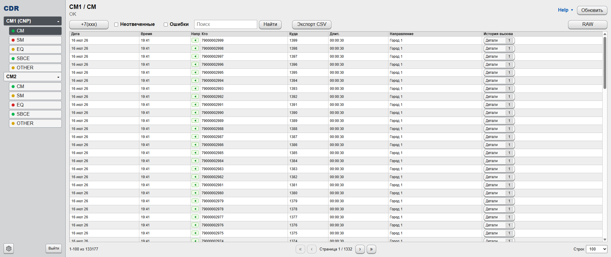

# CDR AVAYA

Web-система для приёма, обработки, хранения и анализа CDR-записей Avaya.

## Возможности

- приём Avaya Communication Manager CDR по TCP;
- работа с настраиваемым `customized` CDR layout;
- раздельное хранение RAW CDR и итогового журнала;
- обработка цепочек вызовов по UCID;
- загрузка и разбор CDR от Session Manager и Equinox Management;
- приём файлов Avaya SBCE CDR;
- универсальные источники Other: TCP, File, SCP и SFTP, Flat и XML;
- отдельные ACD и отдельные цепочки обработки источников;
- словари номеров, транков, направлений и адресов;
- фильтры, поиск, CSV-экспорт и просмотр RAW;
- диагностика служб, источников, PostgreSQL, Docker и дисков;
- системный backup/restore, расписания и удалённая копия по SCP;
- авторизация и разграничение доступа к ACD;
- offline-установка и версионные обновления через UI.

## Поддерживаемые системы

### Communication Manager

Принимает CDR по TCP, хранит исходные записи и собирает связанные этапы звонка в единый журнал по UCID. Поддерживает настраиваемые поля CDR, направления, транки, VDN, словари и просмотр полной цепочки вызова.

### Session Manager

Забирает XML CDR с одного или нескольких серверов Session Manager. Сохраняет RAW, формирует отдельный журнал и показывает, с какого сервера получены данные.

### Equinox Management

Загружает XML CDR конференций, ведёт журнал конференций и позволяет просматривать их участников. Для нескольких EQ-систем данные и параметры источников учитываются раздельно.

### Session Border Controller for Enterprise

Принимает файлы CDR от SBCE в выделенные папки. Поддерживает несколько независимых экземпляров SBCE внутри ACD и отдельный просмотр данных каждого экземпляра.

### Other

Универсальный источник для сторонних систем. Может принимать поток по TCP, читать локальные файлы или забирать их по SCP/SFTP; поддерживает Flat и XML с настраиваемым набором CDR-полей.

## Нагрузочное тестирование

16 июля 2026 года на VMware-стенде проведены нагрузочные и аварийные испытания экспериментального ACD Load Balancer и дискового spool listener.

Подтверждено:

- 50 000 записей от одной ACD со скоростью 10 000 записей/с без потерь;
- кратковременный суммарный поток 20 000 записей/с от двух ACD;
- равномерная обработка очередей разных ACD;
- восстановление 5 000 принятых записей после остановки PostgreSQL и `SIGKILL` listener;
- повторное чтение spool без создания дублей;
- до 68 108 записей/с в отдельном тесте пакетной записи PostgreSQL.

Тестовый стенд: VMware, 4 vCPU и 7,52 GiB RAM.

[Полный отчёт с Hardware Info, версиями ПО, методикой и ограничениями](docs/LOAD_TEST_REPORT_2026-07-16.md)

Важно: показатели относятся к коротким синтетическим прогонам на указанном стенде. Это не результат суточного теста и не универсальная гарантия для любого оборудования.

## Статус проекта

Проект активно разрабатывается и проходит испытания на тестовом и рабочем контурах. Исходный код пока находится в приватном репозитории; публичный репозиторий содержит описание, результаты испытаний и материалы проекта.

## Связь

Автор: [vovan-T](https://github.com/vovan-T)

Вопросы и предложения можно оставлять в Issues этого репозитория.
